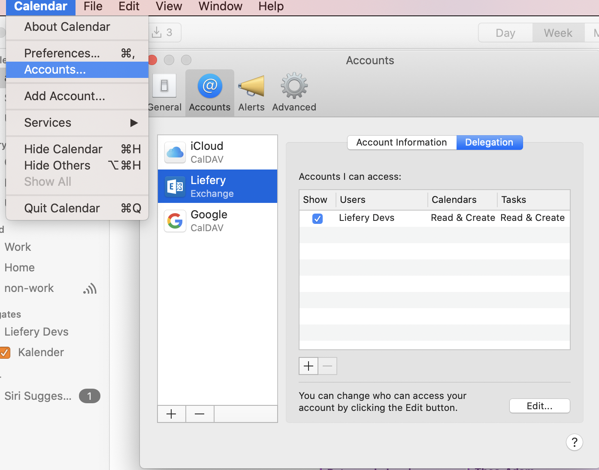

# A Developer's guide to Liefery

## Table of contents

### The essentials

* [Onboarding](#onboarding)
* [Our development process](#our-development-process)
* [JIRA tickets](#jira-tickets)
* [QA - Quality Assurance](#quality-assurance)
* [Remote and asynchronous work](#remote-and-asynchronous-work)
* [Working in the office](#working-in-the-office)
* [Kitchen Watch](#kitchen-watch)


### Processes and procedures

* [Architectural Changes / Changing the way we do things](/docs/making_bigger_changes.md)
* [Buying learning resources](/docs/buying_learning_resources.md)
* [Career](https://github.com/liefery/it-career-ladder)
* [Conferences and travel](/docs/conferences_and_travel.md)
* [Decision meetings](/docs/decision_meetings)
* [Definition of Ready](/docs/definition_of_ready.md)
* [Definition of Ready for Review](/docs/definition_of_ready_for_review.md)
* [Depfu](/docs/depfu.md)
* [Deployments](/docs/deployments.md)
* [Hiring and Interviews](/docs/hiring_and_interviews.md)
* [Internships](/docs/internships.md)
* [SaaS-Support](/docs/saas_support.md)
* [Setting up CI for new projects](/docs/setting_up_ci_for_new_projects.md)
* [Support team](/docs/support_team.md)
* [Team Events](/docs/team_events.md)
* [Team structure](/docs/team_structure.md)
* [Tickety-Tick](/docs/tickety_tick.md)
* [Vacations](/docs/vacations.md)


### Technical reference

* [Glossary](/Glossary.md)
* [Data model](/docs/data_model.md)
* [System Overview](/docs/system_infrastructure.md)
* [Infrastructure](docs/infrastructure.md)
* [Reporting](/docs/reporting.md)
* [Monitoring tools](/docs/monitoring_tools.md)
* [Liefery Academy](/docs/liefery_academy.md)
* [How to QA the courier app](/docs/how_to_qa_the_courier_app.md)
* [How to QA the label printer](/docs/how_to_qa_the_label_printer.md)
* [Testing](/docs/testing.md)
* [Updating Ruby version](/docs/updating_ruby_version.md)
* [Ruby/Rails Style Guide](/docs/ruby_rails.md)
* [JavaScript Style Guide (incomplete)](/docs/javascript.md)
* [CSS Style Guide](/docs/css_style_guide.md)
* [React Style Guide](/docs/react_style_guide.md)
* [Redux Style Guide](/docs/redux_style_guide.md)
* [Flow (JS type checking)](/docs/flow.md)
* [AngularJS](/docs/angular.md)
* [Continuous Integration](/docs/setting_up_ci_for_new_projects.md)
* [Setting up new repositories](/docs/setting_up_new_repositories.md)


## Onboarding

Welcome to Liefery, we are happy that you are here! <3 Here are some helpful
tips to help you get started!

### Your computer

Your computer should be already waiting for you when you come to the office
on your first day. In fact, if you are reading this, that is probably the
case.

The operating system may be already pre-installed for you or you may have
to do it by yourself.

#### Security considerations:
1. Please pick a strong password. If the operating system was already
pre-installed, please change the default password.
2. Please enable hard disk encryption.
   - In MacOS it is called [FileVault](https://macpaw.com/how-to/use-filevault-disk-encryption). Please do not use the option with storing
   the recovery key in iCloud. Choose the manual option and store the key in 1Password.
3. Make sure that you have automatic screen locking enabled and also do it
manually every time you leave your computer.
4. Please use a [password manager for storing your password. You will be provided with a  [1Password](https://1password.com/) account. This is what we use to securely store and share passwords for all our various accounts on different services.

### Communication

- Prefer gender agnostic words when addressing groups of people, i.e., people/team instead of guys.
- Prefer direct/private communication when problems arise, i.e., when a problem happened that implicates one person,
address the problem in private with that person, if you don't feel comfortable doing so please contact a team member
you feel comfortable with to help mediate the conversation.
Retrospectives should not be the first place to address a problem involving two people, but problems can be addressed
if after talking in private you both decide other steps should be taken (improve docs, change something, etc).

### Basic accounts

There are quite a few accounts / external services that you need access to
and they depend on your role in the team, but the basic ones are:

1. **email** - your company mailbox in `liefery.com` domain. It will be provided
to you by the IT infrastructure team. You can log in to the web client at
https://outlook.office.com. You should be part of
[Liefery Devs group](https://liefery.sharepoint.com/sites/dev)
2. **Slack** - an invitation for the Liefery and Liefery-IT workplaces will be sent to
your company mailbox by a person with admin rights
3. **JIRA** - an invitation will be sent to your company mailbox by a person with
admin rights
4. **GitHub** - please send your GitHub username to a person with admin rights via
Slack and they will give you access to the repositories in the `liefery` group
5. **1Password** (password manager) - an invitation will be sent to your company
mailbox by a person with admin rights
6. **Personio** - it is an application for requesting time off, requesting remote
days and reporting sick leave. It also contains your important personal
details, so please double check them and provide your bank account number so
you can get paid. Login here https://lieferfactory-gmbh.personio.de/. If you don't have an account yet, please ask people in HR.

#### People with admin rights:
- Christian
- [Team leads](https://github.com/liefery/don-t-panic/wiki/Teams)

### Other Access

If you are working on Liefery Backend, you will need **alpha** and **staging access**. These are instances of the app where we can test new features before releasing them to our users (in *production*). You'll have to find your SSH public key (ask a coworker who uses the same operating system if you need help with this). Once you've got it, send it to a team lead or Christian and they will coordinate with the friendly people at [Makandra](https://makandra.com/) who handle our hosting to set you up.
Once you have the ssh access to staging, you can use `geordi` to operate on it. For example
```
$ geordi shell liefery/staging
```
will connect you with the staging shell of the liefery backend where you can run rake tasks and such.
```
geordi console liefery/staging
```
will get you to the staging console.

### Other important links

#### Vacation, sick days, home office calendar

[Link](https://liefery.personio.de/calendar/ical/1451259/Hn2I7ceQfYrr7rgeOIziHmOtiYZWKMhZAuJod3y1LLbr9z3u8pzdUkULB47RTK9GG10DfcIsJ8TrOahYe6HUxpfT9XMWM288RU21t2ldztUhQdCrF4f3MuSvTh0dfpit/time_off=132087+time_off=132088+time_off=132089+time_off=132090+time_off=132092+time_off=132091+time_off=151645+time_off=151646+time_off=151647+time_off=151648+time_off=151650+time_off=151651+time_off=151653+time_off=151655+time_off=151990/0/calendar.ics)

You need to subscribe to this calendar.
In Calendar on Mac, *File > New Calendar Subscription...* and paste the link.
In Outlook online click on `Add calendar` -> `Subsribe from Web` and page the link.

#### Liefery Devs calendar

This calendar is a "Shared Office 365 Calendar". This is how you configure it in Calendar on Mac



#### E-books

You can find our e-books [here](https://liefery.sharepoint.com/:f:/r/sites/dev/Freigegebene%20Dokumente/ebooks?csf=1&e=lG3Uvz). Please don't
share the files outside the company!


### Setting up your development environment

The instructions how to set up your development environment are on GitHub,
in the READMEs of individual projects.

While working on a particular project, it's important that the version of each tool/language you are using in your development environment is the same as the one used in production, so that everything works as expected between environments. It is recommended to use
[asdf version manager](https://github.com/asdf-vm/asdf) for this purpose. Unlike some other version managers, asdf is not limited to one language or tool; it
supports multiple ones thanks to plugins. You will find the configuration
file for asdf (always named `.tool-versions`) in some of our repositories and we plan to
add it in other places, too. Even if you don't use asdf you can still look
at the file as a reference.

Managing the Ruby version is an exception. It is specified in the
`.ruby-version` file, because this file is supported by commonly used tools
- RVM and rbenv. asdf can be
[configured to support the `.ruby-version` file](https://github.com/asdf-vm/asdf#the-homeasdfrc-config-file),
too.

### Liefery Academy

Check out [Liefery Academy](/docs/liefery_academy.md) for knowledge sharing talks.

## Our development process

We form project groups (we call them "squads") to work on a certain topic
or a few features that are related to each other. The squad works for 4 sprints
(4 weeks). These 4 weeks are called a "season". After a season we have an
"off-season" that lasts for one sprint.

### Squad

A squad consists of minimum two people that work together. The squad is
cross-functional and organised around a topic / bigger feature. The squad is
involved in the design and requirement gathering process as much as possible.
It takes ownership over their project and drives the design, breaks down [JIRA tickets](#jira-tickets), calls for meetings with business stakeholders to clarify questions.
The squad has one [Squad Coordinator](#squad-coordinator).

Squads are not fixed, but are recombined around interests and skills when a
new season starts. The process for allocating people into squads is as follows:
1. we schedule a topic introduction meeting where topics are discussed and holidays
   are mentioned. Possible scope issues can be addressed and topics can be
   reshuffled among squads if deemed necessary.
2. every team member sends an email to Christian and the team leads via
   j7s2n0i1x0w9s9t2@lieferyit.slack.com in which they say which
   squad they want to be part of.
3. Christian and team leads decide on the squad allocations, taking into account
   preferences, skillsets, experience and previous allocations. They email
   these decisions to the team.
4. everyone can then email Christian and team leads about whether or not they'd like to
   be squad coordinators.
5. Christian and team leads publish squad coordinators.

Holidays are also part of season planning. For sick leave we decide on a case
by case basis.

If a person finds themselves alone on a squad (due to holidays/sickness),
it is up to that person to alert the rest of the team (most likely
via slack) that they are alone. Depending on how long the situation may last,
it may be necessary to reshuffle squads or revisit the project scope. This will be
determined on a case by case basis.

We explicitly want to avoid creating "knowledge islands" where only one or two
people have expertise in a given area of the application. In order to prevent
this we shuffle squads and give internal knowledge sharing talks for other
squads. Additionally, every pull request should be always reviewed by one
person outside of the squad.

### Squad Coordinator

Squad Coordinator is a facilitating role that helps us organise work within
a squad. A Squad Coordinator is responsible for:
- improving communication within the squad
- making sure that squad stand-ups happen
- looking at the JIRA tickets ahead of time and clarifying them
- checking if the squad is on track to finish the season scope

Squad Coordinator is not a leader role. Everybody is encouraged to be a Squad
Coordinator, regardless of their work experience and title.

#### Tasks of a squad coordinator
Before the season:
- create a Slack channel for the squad (unless it already exists) and invite squad members and the product team;
- get acquainted with the topic;
- arrange a season planning meeting (1-1.5h) after the season start (for example on Wednesday morning) and invite Product Team to join it;
- ask the squad members to have a look at the core tickets of the squad, by posting to the Slack channel:
>   @here please have a look at the following tickets before our meeting. Feel free to already add your questions to the ticket comments.
>  - https://liefery.atlassian.net/browse/LIEF-11744
>  - https://liefery.atlassian.net/browse/LIEF-12373

Note: we want to avoid filling off-season with preparation for the coming season, so that everyone has time to focus on their off-season projects. This means that activities like: planning for the coming season, deep investigation of the related code, breaking down tickets, etc, should be scheduled for after the season starts. As squad coordinator, you should do enough planning that all squad members know their first task when the season starts. Often, this task will be: "look at the code surrounding X and our squad tickets to prepare for a productive planning meeting."

Season planning meeting:
- together with the team split the main ticket (s) into smaller sub-topic tickets.
Don't attempt to do this alone, as doing it together helps with the common understanding;
- agree on the time for daily stand-ups (usually between 11am and 12:30pm);
- create a calendar event for the stand-ups;
- do the planning for the first sprint.

Sprint planning meeting, every week some time before the retrospective on Tuesday:
- prepare enough individual tickets for the upcoming sprint;
- pick the tickets to work on in the sprint.

Stand-up meeting, every day:
- start an in-person meeting or a Slack call for a stand-up;
- use a deterministic way to decide the order of the speakers in a stand-up instead of "who wants to speak next?"

Every Monday afternoon:
- have a squad coordinator checkup with Christian or a team lead about the progress of the squad.

General:
- use Slack for stand-up calls, and Zoom with recording for other kinds of meetings;
- keep an eye on squad's PRs;
- watch out for possible conflicts or duplication of effort between PRs;
- when necessary, forward questions to the product team. If there's multiple questions, arrange a meeting.

If two (or more) squads are merged at some point during a season, a new Squad
Coordinator should be selected from among the incoming Squad Coordinators
in order to alleviate confusion. The new supersquad should begin having stand-ups
together as soon as possible, even if they are only expected to be merged
temporarily.

### Edge squad

Edge squad is a special squad for dealing with the day-to-day upcoming
requests, and issues that are too small for allocating the whole season to
them. Edge should not work on tickets with a deadline, or with a high priority.

Edge tickets are all tickets that have the `Edge` epic or
that don't have an epic assigned to it.

### Season

A season consists of 4 weeks focussed on delivering a feature or groups of features.
After 4 weeks the work should be in a state that is possible to deploy and present.
The feature scope is decided at the beginning of the season and sub-scopes are
decided per week to make sure we are on track. If we are not on track, we can
cut scope or ask for help from other squad members.

If the feature can’t be delivered in a season, then the squad should choose part of
the scope and use feature flags to hide the feature until ready. One squad member
should be in charge of the feature and continue in the squad until the feature is
completed (during upcoming seasons). Bugs and small refactorings are part of the
feature scope.

A feature is done when it has the minimal working version and it’s properly tested
Knowledge sharing talks can also happen during a season.

Squads which finished the work on the main planned feature help other squads,
work on smaller tickets from the backlog or join the Edge squad. We do these
things as individuals, not as the whole squad, so for example one person can
join a regular squad and the other person can join the Edge squad. We switch
to these tasks as soon as we delivered the minimal working version of our
feature. In particular, we should avoid working on additional "nice-to-have"
tasks related to our topic. Instead, we should wait for the feedback from our
users and schedule the improvements for a future season.

### Off-season

The off-season time is meant to provide a change in pace ("breathing time") and in the type and scope of activities and also to provide room for working on your own ideas. This time should be as self-directed as possible while still making sure it provides direct value to our project.

The off-season topics should fall in one of the following categories:
* improvements to our code base (e.g. refactoring, cleaning up)
* experiments that might give us important insights (e.g. try out if library X solves problem Y)
* tooling and process improvements (e.g. features for our bots, automate something annoying)
* knowledge sharing
* write [blog post](https://github.com/liefery/engineering-blog)
* prepare a talk for a meetup or conference (please mention that you are working for Liefery to promote us as an employer)
* features / enhancements you would like to see (e.g. MDL design, better logging, ...)
* learn something that is directly associated with your current or future work

Feel free to suggest a topic and run it by the team leads even if it's not included this list and if you think it would make a good off-season topic.

To find tickets to work on we add the `off-season` label to tickets that seem
like suitable off-season work. You can get an overview with
[this JIRA search](https://liefery.atlassian.net/browse/LIEF-8206?filter=10904).

It’s also totally fine to allocate time to organising coding-related community events (eg code curious workshops) during off-season.

The other things that happen during an off-season:
1. season planning and design meeting
2. squads presenting the results of the last season, and sharing the knowledge
   about this area of the system

### Pair programming

Pair programming is a regular part of our development process, sessions can be problem-oriented but don't have to be.
Things we agreed on:
1. We plan pairing sessions during stand-up according to what tickets require, how many tickets are available at that point (e.g. at the beginning of a season), and what pairing needs, wishes, and availabilities there are - also according to individual needs and wishes for working alone.
2. Additionally, we post pairing availabilites in Slack - squad channels for squad-related work, team channels for team-related work, general/coding channel for non-squad-or-team-specific things.
3. Pairs agree on a time to reserve for the pairing session and on a pairing mode/technique.
4. Pairs regularly take breaks & re-evaluate how long it makes sense to keep going.
5. Pairing can also be a good option for code reviews.
6. We reflect on our pairing experiences during retros and make adjustments as needed.

### One-on-ones

1-on-1s with your team lead are supposed to happen regularly at least once a month. Less frequently, you'll also have 1-on-1s with Christian.

If there's anything on your mind please bring it to the 1o1s but you don't have
to wait until your next 1o1 - the earlier we fix problems the better. So, feel
free to just ask if you can have a 1o1 coffee/chat.

### Finishing big topics/features

If a topic is bigger and/or has been in development for a longer period of time,
it is important to _finish_ them properly. This includes but is not limited to:

* Have ample time for QA
* Going through the whole feature and its use cases again to make sure that
  everything is there and makes sense
* Thinking about how other features in the system might interact with it
  (What happens if a tour schedule is closed early? What happens if tour
  appointments are edited? ...)
* Go through remaining tickets for the topic that are still in backlog -
  are they really not important for launch or irrelevant? (Make sure we didn't
  accidentally forget anything)
* As mentioned in _off-season_ give a little presentation where you talk about
  the feature, implementation & learnings


### Stand-ups

We have mini stand-ups in squads. Each squad is responsible for organising their
own stand-up at the time and format convenient to them.

### The retrospective

The retrospective happens every week on Tuesday, after lunch (14:00), and before the
sprint planning of the next sprint. The purpose of the meeting is to collect
feedback from everyone on the team about how the last sprint went with regards
to productivity, motivation, collaboration and our development process and to
use this feedback to continuously finetune and adapt our process.

The retrospective focuses more on the people and the team than very technical
discussions. We try to cut long discussions early and move them to separate
meetings.

Based on the suggested improvements we create decisions - action items. As much
as possible every action item should have a person responsible for it. This can
be for example scheduling a meeting or sending an email. Sometimes we have
decisions "we will try really hard to / not to", but these are more difficult
to track.

Each retro will need a volunteer to facilitate the retro. We decided on a retro rota which you can find in the channel description of the #general channel in slack.

#### Agenda
**Summary:**
* turn off recording
* check-in with mad/sad/glad/afraid
* turn on recording
* company news
* share likes/wishes
* stack similar cards
* hidden voting (3 votes per person)
* discuss wishes / create action points
* check action items from last retro
* (optional break)
* support team
* QA person
* bi-weekly OPS-BD-IT meeting dev
* demos (timebox is 25 minutes, for off-season divide time by people who want to demo)
* sprint planning / off-season planning
* (in sprint 3 or 4 anounce next season's topics)

Agenda:
1. Visit https://retrotool.io/ and create a new Retrospective (start with a blank board) and prepare the columns `like` and `wishes`
2. Share the link with the team a view minutes before the retro starts in the slack channel `#general` and invite them to already prepare their notes. People should write their name on each of the cards.
3. Since you are hosting the retro, you are also responsible for the notes. The notes are stored in https://github.com/liefery/liefery-backend/wiki.
4. The retro starts with everyone checking in and sharing their feelings, based on the four core emotions: sad, mad, glad and afriad. The recording has to be turned off for that.
5. Next turn on the recording and invite the CTO to share the company notes, which you will write into the notes.
6. After that, pick a person or start yourself - the person should drag & drop card after card from the private section to the public section of the board and shortly talk about each card. You are responsible for facilitation so keep track of who didn't talk yet and after each person say the name of the next person who didn't share yet.
7. The cards who are similiar can be clustered by drag & drop one of the cards on the top of the other - this can be done as the process goes on.
8. When everybody shared, the people should vote (the + and - buttons on each card) on the topics they want to talk about. __Each person has 3 votes in total__. You are invited to use the "hidden voting" function until everybody is done. After voting you can sort the cards by voting automatically - you find this option on the settings of a column.
9. Depending on the time, we go through each of the cards with the highest voting.
10. Based on the discussions and decisions, action items are created which you should also note within the tool.
11. Look at the decisions from the previous week and evaluate if they were implemented. If not, move them to the decisions from the current week.
12. Export the board with the export-feature of the tool and place it, together with the information who will do support team, in the [wiki](https://github.com/liefery/liefery-backend/wiki).

After the retro in the same timeslot of the meeting:
1. Ask who is willing to do support for the next sprint.
2. Share who is doing QA based on the QA rota which is in the description of the #quality-assurance channel in slack.
3. Ask who wants to demo things which were done during the last sprint. This part is timeboxed to 25 minutes in total. When we have off-season retro ask beforehand who wants to demo and split the timebox by the people who want to present and share with the people what their individual timebox is.
4. After this ask the Squad Coordinators to share their Sprint Planning, which you can read more about in the next section.

Meeting notes from older retrospectives are available in the [Liefery backend wiki](https://github.com/liefery/liefery-backend/wiki/retros).

### Sprint planning / Off-Season planning

Each squad plans their own sprint by selecting the tickets they think they can commit to from the prioritised Jira backlog. It might be necessary to clarify requirements or organise a technical meeting before coding starts to ensure that the tickets meet our [Definition of Ready](docs/definition_of_ready.md).
It is also the time to reflect on the question **"Are we on
track to finish the planned scope within the current season?"**

The whole team sprint planning happens every week on Tuesday, after the retrospective meeting. During the meeting each squad presents the team what they are planning to do.

If the season is ending and you have the off-season ahead, please ask everyone for their plans and encourage people to find pairs if they want to work together on something. Also make sure that people who are relatively new in the team have something on their mind that they want to work on.

### Pull Requests and Reviews

As soon as you have comittable changes or before you are going on a break
push your changes to github and create a Pull Request with the label _work in progress_.
Thereby your code is backed and others can already have a look at what you
are working on.

Pull Request Reviews are at the core of our process to ensure high code quality,
catch bugs and share knowledge. Everyone reviews, be it after taking a break,
finishing a ticket or whatever. We want to have as little open Pull Requests
as possible to have tickets flow through quickly, giving reviews so that they
can be addressed plays a major part in this.

To be up to date on pull requests to review across repositories you can use
[this magic Github link](https://github.com/pulls?utf8=%E2%9C%93&q=is%3Apr+archived%3Afalse+user%3Aliefery+is%3Aopen).

The **rules of code review club** are as follows:

* Be nice
* It's always about the code, never the people
* Do reviews frequently e.g in morning and again around lunch time.
* Start with the oldest PRs unless there is stuff that needs to be prioritized
* When there’s a controversial PR consider a synchronous chat to sort it out (but document the results and arguments for how the result was reached in PR).
* Be constructive (_"Couldn't we improve X if we did Y?"_)
* It's ok to nitpick (especially naming, but also whitespace and friends)
* It's also good to propose a completely different approach to a problem,
especially if it makes the solution simpler
* It's ok to ask questions (_"Why do we ...?"_)
* Ideas and suggestions that are "nice to have" should be handled in follow-up
  tickets. Think in terms of incremental improvements. Ask yourself the
  question "can we ship this PR without my suggestion?" If it does not break
  tests, and it does not break existing functionality, and it does not make the
  code quality worse, then it is good to be merged.

When you start reviewing a PR, please add the label _in review_. This is to make
sure that a PR is not merged as you are reviewing it. When you are done the review,
remember to remove the label.

Once you finish your review submit as either a _Comment_ or _Approve_. You can
apply the following labels:

* **Pending Updates** - You had some remarks or questions that should be
addressed/answered
* **Merge when CI Passes** (or just hit merge if CI passed) - comments of all
reviewers are addressed and you feel this PR is good to go (a bot will merge it
automatically)
* No Label - You reviewed it and feel it's good (no updates needed from your
side) but you feel it should still be reviewed by at least one other person
for whatever reason

We do not generally use the _Request Changes_ functionality unless something
would be _severely_ broken. This is because _Request Changes_ is tied to that
one reviewer accepting them and this goes against our vision of collective
code ownership. If I request changes, then anyone of my colleagues can see and
agree that they have been addressed and are therefore fine now.

If a PR has failing specs and you think that they are flakies, feel free to write
`jenkins test this please` as well as the path to the failing spec as a comment in
the PR. This will restart CI for you and give others an idea of which spec failures
are real and which failures are flakies.

When you submitted a PR and your code was reviewed:
1. make the suggested changes if you agree with them. Please do not use `git amend`
   if someone has already reviewed your code because it makes it very hard for your
   reviewer to see the latest changes.
2. answer questions and explain your point of view if you do not agree with a
   suggestion
3. make sure that the reviewer or any other team member is on board with your
   explanations (wait for their answer or +1)
4. remove **Pending Updates** label

Please do not merge your own pull requests when you think that you addressed
the whole feedback. It is really easy to misunderstand a comment and make
different changes than requested. Give other team members a chance to double
check the changes and hit "merge".

## JIRA tickets

Every pull request should have a corresponding ticket in JIRA. It helps us with tracking:
- what is deployed in each release
- what was done in the current sprint.

Please create JIRA tickets even for small pull requests - fixing
typos, improving documentation and small refactorings.

This handbook is an exception to this rule. Please do not create JIRA tickets
for handbook updates.

The helpful link that speeds up creating tickets is [here](https://liefery.atlassian.net/secure/CreateIssueDetails!init.jspa?pid=10003&issuetype=4&priority=5&components=10007&fixVersions=10900&customfield_10006=0).

We assign new tickets with a Component, Fix Version and Epic Link.

- **Component** - stands for Liefery’s apps, which can be deployed separately (Backend, Homepage, Whitelabel app, Fluttery, etc.).
- **Fix Version** - to assign tickets to the correct bucket. Those buckets are our vision buckets, as e.g. “Product Backlog” is for the short-term-vision tickets, while “Roadmap” tickets are planned in a longer term and aren’t as well described as tickets from Product Backlog. “Review” version is for the tickets you want the Product team to prioritise. “Technical Backlog” rather consists of refactoring/maintenance tickets, which are to be picked in the off-season by team leads or when teams find suitable. Most importantly, we want to avoid having tickets without versions.
- **Epic Link** - for ticket categorisation. Bigger/seasonal topics are created as epics, which get broken down into stories. In order to track the progress of an Epic, we will be able to find all respective stories in one view.
    - Note for Backend teams: After the squads are disassembled, stories that would have usually belonged to the same epic get assigned to an “Edge” epic, which our permanent Edge squad tackles.

Once the required ticket fields are added, please choose one of the following:
1. assign the new ticket to the current sprint
2. assign the ticket to the Fix Version "Review" for prioritisation
3. move the ticket to a suitable spot in the Backlog
        - In this case, informing the product team always helps, as one of their tasks is prioritising tickets.

Labels are not required as we do not use them.

When a ticket needs to be split into smaller tickets, the new tickets should follow these rules:
  - Split an existing ticket by creating a new ticket
  - Reference the parent ticket in the new ticket
  - List possible dependent tickets
  - Describe the task from a perspective of somebody who doesn't know about the previous tickets

In case your ticket results in a follow-up ticket (e.g. your implementation on staging raises an error and therefore a bug-ticket creation is needed), besides linking the ticket togehter in JIRA with “blocked by”/”blocks”, make sure to notify your QA colleagues in slack or in a comment in JIRA to prevent the case that they start the QA-process for the ticket which is currently blocked.

The ticket title should be updated to reflect the work done. Usually tickets are written from the business perspective,
this means that sometimes the title doesn't reflect the real change being done, if this is the case, copy the original title
to the description and change the title.

If a task takes more than 2 days you should inform the team during the stand-up,
we may decide to break it down into smaller tickets or pair you with someone.

We use Tickety-Tick to automatically associate pull requests in GitHub with
JIRA tickets. Please install it and configure according to the instructions
[here](/docs/tickety_tick.md).

## Quality Assurance

QA happens as soon as tickets are put onto alpha / staging.

Ticket descriptions should include QA instructions that are written from
the perspective of the user trying out the feature. If that's
impossible (internal changes, refactoring), base QA instructions should
be written by a developer working on the ticket.

Before you submit a PR add an additional QA comment to your ticket describing non obvious
things that you touched and that should be tested. Also make sure to mention which environment
the ticket should be tested on. For example: if it is behind a feature flag, it should
usually be tested on alpha.

QA results in one of 3 things:

* **Accepted** - ticket is good to go to production, everything is fine :+1:
* **Accepted but follow up** - a follow up ticket is created (either right in TODO or in the backlog) as either the ticket works already but could work better through some improvements (something is missing, better UI etc). In any case, ticket breaks nothing.
* **Rejected** - ticket doesn't work and does active harm to the system. **When there are rejected tickets we must not deploy**.

Both accepted cases are fine, depending on the size and impact of the follow up it should be prioritized higher to maybe get it in. Dealing with rejected tickets is another story.

### Dealing with rejected tickets

Rejected tickets are bad, as they are deploy blocking. We want to unblock
the deployment as fast as possible, that's why addressing rejected tickets
should be **a high priority**. In general, we favour reverting rejected
tickets over trying to fix them up.

The fixing work flow is usually as follows:

* Is the ticket trivial to fix, someone can pick it up immediately and
  we have enough time for QA before a deploy? Create a follow up ticket and fix it.
* Ticket fix time is unknown/too long?
  * Make a PR to revert the changes. If the previous behaviour can be
  restored only by UI changes, favour reverting UI changes over reverting
  the whole ticket. When in doubt (for example the original author is not
  available for help) - revert the whole commit.
  * If the whole commit had to be reverted and there are migrations,
  rollback the migrations on alpha and all staging environments before the PR is merged
  * Pull ticket back in TODO (from rejected) and leave a link to where it was reverted
  * Whoever grabs the ticket (likely original author but doesn't have to be) reverts the revert again and fixes up what has come up during QA

### You absolutely HAVE to deploy to production but there are rejected tickets

(Ideally we should never/very rarely run into this situation if the previous section is followed)

* Can you revert the commits easily that are blocking? (see previous section)
* Worst case, cherry pick changes you need onto production. If you have the time, try it out on alpha / staging (`git reset --hard origin/production` then cherry pick) if not, cowboy time ;)

### QA responsibility

QAing of most of our applications is performed by developers on a rotational basis: every sprint (starting at the end of the Retro on Tuesdays), a new person becomes responsible for QAing. See the #quality-assurance slack channel for the rota. Josi is responsible for QAing the Courier app.

See [our QA documentation](https://github.com/liefery/don-t-panic/blob/master/docs/qa.md) for tips.

Please check the docs for additional information on how to QA the [Label Printer](https://github.com/liefery/don-t-panic/blob/master/docs/how_to_qa_the_label_printer.md) and the [Courier App](https://github.com/liefery/don-t-panic/blob/master/docs/how_to_qa_the_courier_app.md).

### Environments for QA

We have two environments where we perform QA - alpha and staging. Alpha
environment has all feature flags activated. Staging environment mirrors
production as closely as possible when it comes to feature flags.

Please QA features that are behind a feature flag on alpha. Please QA all other
features on staging.

Alpha environment is set up only for some components, but not all of them. This
means that some tickets cannot be QAed on alpha and have to be QAed on staging.
In such a case we may be forced to enable a feature flag on staging.

Staging is also used by our colleagues from other departments and even people
from external companies (to test integrations). Alpha is internal to the IT team.

## Remote and asynchronous work

We are a remote-first team. This means that we want to provide the same work
experience no matter if somebody is in the office or working remotely.
By default all communication is remote-first. Offline communication happens
only when there is a good reason for it.

We have the freedom of picking when our work hours happen. The things that
constrain this freedom are scheduled meetings ("core meeting hours" are
between 11:30 and 16:00) and necessary time overlap with
other team members determined by the current task.

The two concepts that are often conflated are remote work and asynchronous
work. Remote work means working from different physical locations (not in the
office). Asynchronous work means the freedom of organising your own work time
during the day and better controlling distractions.

The primary goal of remote work should not be avoiding distractions and
interruptions. Working remotely does not mean cutting off all communication
channels and focusing only on the coding task in front of you.

It should be possible to achieve the same productivity in the office as when
working remotely. And, it should make little difference for communication
whether somebody is in the office or not.

Async communication guidelines:
1. If you have a question and you are 95% sure that person A can answer it,
   don't reach out to this person directly. Instead formulate your question on
   Slack, in the shared channel and mention person A. It is possible that some
   other people will be able to answer the question as well. It is also likely
   that some other people will be interested in knowing the answer for the
   question.
2. If you have a question that should not be posted in a shared channel,
   please consider sending a Slack direct message first, instead of going
   to the desk of your coworker and asking. This allows them to respond at
   the time convenient to them, without interrupting their flow. When deciding
   whether to send a Slack message or ask directly, take into account how
   urgent your question is.
3. If you want to propose changes in the existing company processes or general
   code techniques, open a pull request that documents the changed situation.
   Other team members can then leave comments at the time convenient to them.
   If there is a general agreement, the PR can be merged. If not, it is time
   for a meeting. Do not default to scheduling a meeting, start with an
   asynchronous discussion in a PR first.
4. If you go back and forth with somebody in a chat conversation or during the
   code review, talk with them offline (when both of you are in the office)
   or start a video call (when one of you is not in the office). Rule of thumb:
   if you have gone back and forth 3 times, it's time for synchronous
   communication.

When working remotely:
1. Make it clear to your co-workers that you're starting your work day - for
   example say "Hi" on Slack.
2. It's fine to turn off notifications for some time to focus on a task, but
   be sure to check them a few times during the day.
3. Let other team members know that you are available for help by posting it
   explicitly on Slack from time to time.

### Remote-first meetings

1. Include a live editable agenda (Office 365 doc) in the calendar invite so
   that people can start the discussion before the meeting.
2. Invite many people, but make the participation optional.
3. Find time that works for most people, but don't strive to find a time that
   works for everybody. It's really hard when the team is bigger.
4. Schedule a meeting in Zoom and add the URL to the calendar invite.
5. Make sure that the meeting will be automatically recorded so the people who
   didn't attend can catch up.
6. Start the meeting on time.
7. Use your own laptop to join the meeting, even when you are in the office.
   Use a dedicated headset to reduce the background noise.
8. Mute yourself when you are not speaking.
9. Follow the order in the agenda. When you finish speaking, pass the voice
   to the next person in the agenda by calling their name.
10. When you want to speak after the current person, add your point to the agenda,
    prefixed by your name.
11. At the end of the meeting create action items. An action item should include a
    person responsible for it.

Some additional explanations are
[here](http://blog.sundaycoding.com/blog/2017/08/27/make-your-meetings-more-async/).

### How to create a meeting

1. Create a document for the agenda and create a shareable link in [Office](https://www.office.com/?auth=2)
2. Schedule a New Meeting in [Zoom](https://zoom.us/meeting)
3. Find a slot in the [team calendar](https://outlook.office.com/owa/?realm=liefery.com&path=/calendar/view/Week)
4. Select dev@liefery.com as a participant if the whole team should be invited or invite individual team members
5. Add link to the agenda and Zoom
6. Send the invite

### Zoom

We use Zoom (https://zoom.us/) as our communication tool for meetings. In order
to schedule a meeting using Zoom, use the credentials saved in 1Password.

All Zoom meetings are automatically recorded. You can find the recordings
[here](https://zoom.us/recording).

### Deciding if a meeting should be remote

1. Is at least one participant remote? => remote
2. Is there a chance that somebody will benefit from the recording of the
   meeting? => remote
3. Otherwise => offline

### Sickness

If you are sick, you are sick! Please take as many sick days as you need to get better. A doctor's note is required on your third
day of sickness.

However, sometimes one feels well enough to work, but not necessarily well enough to come into the office. That's totally fine. Please
write in Slack that you are working from home and abide by the "Remote and asynchronous work" section above.

That being said, working from home when you are sick is not required and is not expected of you. Health comes first :)

## Working in the office

People working in the office make a break at 12:45 (call for lunch) where we
stand up and make a decision where to go out for lunch. If you brought your
own food, want to continue working, have a lunch date or because of any other
reason, you are free to skip the call for lunch.

## Kitchen Watch

Approximately once every 3 months you are obliged to be on the kitchen duty for a day.
At the beginning of each cycle you're going to receive a schedule.
Please, find yourself in the list and make a note of your duty date.
If on that day you are going to be on a vacation, to work remotely or to be out of the office for another reason,
please, arrange a substitute in advance.

The main responsibility of a person on duty is to load and unload the dishwasher.
Pay a visit to the kitchen once every hour to see if anything needs to be done.
If the dishwasher is not running, and there's dishes around and on the sink, load them into the dishwasher.
Remember to put bowls, cups and glasses bottom up, so that they don't collect water.
If the dishwasher is about full, put a dishwasher soap tablet in the dishwasher soap tablet tray
(you can find the tablets in the cabinet to the right of the dishwasher),
set the duration to 1 hour and start the machine.

After it has finished, wash your hands, unload the dishwasher and put the dishes and cuttlery back to their places in the cupboard.

If you are in the kitchen and see that the dishes need some attention, please, help with it even if you are not on duty.
